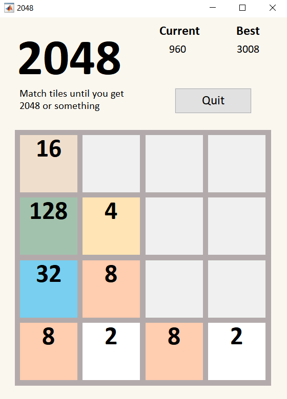

# 2048-Style-Game
A game modeled after the famous "2048" mobile and web game created in MATLAB. Users control the board using the arrow keys and MATLAB's proficiency in arrays handles the rest.

  

## Design Philosophy
I started this project because I didn't know that MATLAB had the capabilities for games, even those as simple as 2048.
For 2048, I intentionally kept the values of the tiles in an array and the UIControls that represented my tiles separately so as not to confuse the two. Therefore, all my calculations and checks for game over,
tile absorption, were done on my array rather than on the 'String' value on my tiles. The bulk of the program's logic was just having separate
processes for different movements ('left','right','up','down') and being able to manipulate my array in such a way to make the program work.
To solve this, I wrote down everything I wanted my array to do when you pressed an arrow key and carefully translated the process into code.

## Closing Thoughts
I learned that MATLAB has more uses than I first thought. Rather than just being a number crunching coding language, it has a variety of uses
and for applications like 2048 that rely on arrays for processing, it excels in being able to process that information quickly and efficiently.
